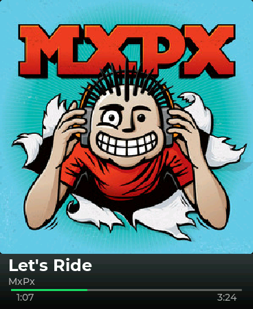

# Bop

Bop is a source-only Spotify remote for the [Waveshare ESP32-S3 Touch AMOLED 1.8 board](https://www.waveshare.com/esp32-s3-touch-amoled-1.8.htm).

It shows the current track and sends touch controls to Spotify. It does not play audio.

    
    

[See Bop in action on X.](https://x.com/mark_a_phelps/status/2087217997429571717?s=20)

## Touch controls

Use these gestures on the Bop screen:

| Gesture | Action |
| --- | --- |
| Swipe left | Previous track ⏮️ |
| Swipe right | Next track ⏭️ |
| Short press | Play or pause ▶️ / ⏸️ |
| Long press | Show the Spotify screen with a QR code for the current track 🎵 |

Tap the Spotify screen to return to the current track.

## Project status

Bop is source software for personal experimentation. It is not an official Spotify product.

This repository provides no firmware binary, package, GitHub Release, release tag, or shared Spotify client ID. You build the firmware and create your own Spotify application.

Spotify restricts Streaming integrations to its Approved Devices. Spotify terms do not clearly state how that restriction applies to a source-only ESP32 repository. Bop makes no claim of Spotify approval.

## Hardware and account requirements

You need these items:

- A Waveshare ESP32-S3 Touch AMOLED 1.8 board.
- A USB data cable.
- A macOS, Linux, or Windows host computer.
- A WiFi network.
- A Spotify Premium account.
- Your own Spotify application and Client ID.

## Support levels

| Host | Support level |
| --- | --- |
| macOS | Hardware-tested installation |
| Linux | Firmware builds in CI |
| Windows | Host tools support it. Hardware installation is untested. |

CI runs on Linux only. Use macOS for the supported hardware procedure.

## Quick start

1. Install Git and [mise](https://mise.jdx.dev/).
2. Run `git clone https://github.com/markphelps/bop-esp32.git`.
3. Run `cd bop-esp32`.
4. Read [INSTALL.md](INSTALL.md), [EULA.md](EULA.md), and [PRIVACY.md](PRIVACY.md).
5. Connect the board with a USB data cable.
6. Run `mise install`.
7. Run `mise run provision`.
8. Run `mise run flash`.

`mise run provision` and `mise run flash` each take a credential-free backup first. A backup made before the first flash is the factory image. `mise run flash -- --force` flashes with no backup. It warns and takes none, and it never makes a backup of a provisioned board possible.

If a valid backup exists, the backup task validates it and does not read the board. If an incomplete or invalid backup exists, the task stops. Move that backup out of `backups/` before you try again.

If no backup exists, the task reads the credential partition first. It reads all flash only when the partition has no credentials.

## Documents

- [INSTALL.md](INSTALL.md) gives the installation, update, removal, and factory-recovery procedures.
- [docs/HOW-IT-WORKS.md](docs/HOW-IT-WORKS.md) explains the hardware, firmware, data flow, and every `mise` task.
- [docs/TROUBLESHOOTING.md](docs/TROUBLESHOOTING.md) lists recovery steps for common device and provisioning problems.
- [CONTRIBUTING.md](CONTRIBUTING.md) explains the contribution workflow, checks, and pull-request requirements.
- [SECURITY.md](SECURITY.md) explains the security policy and the plaintext NVS credential risk.
- [EULA.md](EULA.md) and [PRIVACY.md](PRIVACY.md) describe the terms and data use.
- [THIRD_PARTY_LICENSES.md](THIRD_PARTY_LICENSES.md) lists third-party components and their licenses.

## Security

Bop stores WiFi values, the Spotify Client ID, and the Spotify refresh token as plaintext in device NVS.

A person with physical access to the board can read these values. Read [SECURITY.md](SECURITY.md) before you provision the device.

Run `mise run deprovision` before you give away, sell, or discard the board. The command removes device credentials after you remove Bop access from Spotify.

## License and trademarks

Project code uses the Apache License 2.0. Read [LICENSE](LICENSE).

The Montserrat font uses the SIL Open Font License. Read [THIRD_PARTY_LICENSES.md](THIRD_PARTY_LICENSES.md).

Bop is an independent project. Spotify is a trademark of Spotify AB. Espressif, ESP32, and Waveshare are trademarks of their respective owners.
